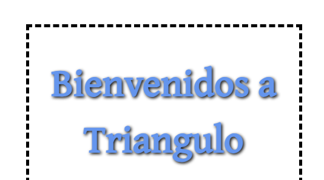

# Etiquetas de edición de texto
## font-family: 
Sirve para cambiar el tipo de letra.
Podemos utilizar algunas predeterminadas, sin embargo, podemos ir a google fonts y obtener mas estilos.
Despues de poner el estilo que tu quieras pones una coma y pones mas tipos en caso de que los anteriores no funcionen
```css
@import url('https://fonts.googleapis.com/css2?family=Gentium+Book+Plus&family=Paytone+One&family=Playfair+Display:wght@500&display=swap');

h1{
    font-family: 'Gentium Book Plus', serif;
    font-family: Cambria,Times,serif;
}
```
## font-size:
Sirve para cambiar el tamaño de la letra.
```css
h1{
    font-size: 64px;
    font-size: 24px;
}
```
## text-align:
Funciona para alinear el texto.
```css
h1{
    text-align: center;
}
```
## color
Funciona para darle color al texto.
```css
h1{
    color: green;
}
```

## text-shadow:
Se utiliza para aplicar sombras al texto dentro de un elemento. Permite agregar efectos visuales interesantes y resaltar el texto en una página web.
```css
text-shadow: offsetX offsetY blurRadius color;
```
* **offsetX**: Especifica el desplazamiento horizontal de la sombra con respecto al texto. Un valor positivo desplaza la sombra hacia la derecha, mientras que un valor negativo la desplaza hacia la izquierda.
* **offsetY** especifica el desplazamiento vertical de la sombra. Un valor positivo desplaza la sombra hacia abajo, mientras que un valor negativo la desplaza hacia arriba.
* **blurRadius** define el radio de desenfoque de la sombra. Un valor mayor crea una sombra más difusa y suave, mientras que un valor menor produce una sombra más nítida.
* **color** establece el color de la sombra. Puedes usar nombres de colores, códigos hexadecimales, valores RGB o valores HSL.
```css
h1 {
  text-shadow: 2px 2px 4px rgba(0, 0, 0, 0.5);
}
```
## width:
Se utiliza para establecer el ancho de un elemento. Puedes utilizar diferentes unidades de medida para definir el ancho, como píxeles (px), porcentaje (%) o unidades relativas como em o rem. 
```css
div {
  width: 300px;
  width: 80%;
}
```
## margin:
 Se utiliza para establecer los márgenes exteriores de un elemento. Los márgenes son espacios vacíos alrededor del contenido de un elemento, y se pueden ajustar en las cuatro direcciones: arriba, derecha, abajo e izquierda.
 ```CSS
 div {
  margin-top: 10px;
  margin-right: 20px;
  margin-bottom: 15px;
  margin-left: 30px;
}
 ```
 Aquí, se establecen márgenes diferentes para cada dirección. El margen superior es de 10 píxeles, el margen derecho es de 20 píxeles, el margen inferior es de 15 píxeles y el margen izquierdo es de 30 píxeles.

 ```CSS
 div {
  margin: 10px 20px 15px 30px;
}
 ```
 En este caso, se utiliza una sintaxis abreviada para establecer los márgenes en el orden: arriba, derecha, abajo, izquierda. El margen superior es de 10 píxeles, el margen derecho es de 20 píxeles, el margen inferior es de 15 píxeles y el margen izquierdo es de 30 píxeles.
 ## float:
 Se utiliza para establecer la forma en que un elemento se coloca y flota dentro de su contenedor.

 Los valores posibles para "float" son "left", "right" y "none". El valor "left" hace que el elemento flote hacia la izquierda, el valor "right" hace que flote hacia la derecha, y el valor "none" (predeterminado) no aplica ningún flotamiento.
 ```css
 p.capital::first-letter{
    float: left;
 }
 ```
 ## background-color:
 Sirve para darle color de fondo a algun contenedor.
 ```css
 h1{
    background-color: blue;
 }
 ```
 ## padding:
 La propiedad "padding" en CSS se utiliza para establecer el espacio de relleno (espacio interno) alrededor del contenido de un elemento. Los valores de "padding" se aplican en las cuatro direcciones: arriba, derecha, abajo e izquierda.
 ```CSS
div {
  padding-top: 20px;
  padding-right: 15px;
  padding-bottom: 10px;
  padding-left: 5px;
}
 ```
Aquí, se establecen espacios de relleno diferentes para cada dirección. El relleno superior es de 20 píxeles, el relleno derecho es de 15 píxeles, el relleno inferior es de 10 píxeles y el relleno izquierdo es de 5 píxeles.

 ```CSS
div {
  padding: 10px 20px 15px 5px;
}

 ```
En este caso, se utiliza una sintaxis abreviada para establecer los valores de relleno en el orden: arriba, derecha, abajo, izquierda. El relleno superior es de 10 píxeles, el relleno derecho es de 20 píxeles, el relleno inferior es de 15 píxeles y el relleno izquierdo es de 5 píxeles.

Recuerda que el "padding" afecta al espacio interno de un elemento y puede utilizarse para ajustar el espaciado entre el contenido y los bordes del elemento.

## text-decoration:
La propiedad "text-decoration" en CSS se utiliza para agregar decoraciones visuales al texto. Esta propiedad permite aplicar una variedad de efectos, como subrayado, tachado, línea encima del texto y línea debajo del texto.

Los valores más comunes para "text-decoration" son los siguientes:

"none": Es el valor predeterminado y no aplica ninguna decoración al texto.
"underline": Agrega un subrayado al texto.
"overline": Agrega una línea encima del texto.
"line-through": Agrega una línea que atraviesa el texto (tachado).
"blink": Hace que el texto parpadee (este valor no es ampliamente compatible y se desaconseja su uso).
```css
a {
  text-decoration: underline;
}

p {
  text-decoration: line-through;
}
```
## text-transform:
 Se utiliza para controlar la transformación del texto, es decir, cómo se muestra visualmente el texto en términos de mayúsculas y minúsculas.

Los valores más comunes para "text-transform" son los siguientes:

* **"none"**: Es el valor predeterminado y no se aplica ninguna transformación al texto.
* **"uppercase"**: Transforma el texto en letras mayúsculas.
* **"lowercase"**: Transforma el texto en letras minúsculas.
* **"capitalize"**: Transforma la primera letra de cada palabra en mayúscula.
```css
h1 {
  text-transform: uppercase;
}

p {
  text-transform: lowercase;
}
```
## font-weight:
La propiedad "font-weight" en CSS se utiliza para especificar el grosor o la densidad de la fuente de un elemento de texto.

Aquí tienes algunos detalles importantes sobre la propiedad "font-weight":

Los valores más comunes para "font-weight" son los siguientes:

"normal": Es el valor predeterminado y define el grosor de fuente normal o estándar.

"bold": Aplica un grosor de fuente en negrita.

"lighter": Indica un grosor de fuente más ligero que el valor normal.

"bolder": Indica un grosor de fuente más grueso que el valor normal.

También acepta valores numéricos. Estos valores numéricos varían de 100 a 900 y permiten un mayor control sobre el grosor de la fuente. Los valores más comunes son 100, 200, 300, 400 (normal), 500, 600, 700 (bold), 800 y 900.
```css
h1 {
  font-weight: bold;
}

p {
  font-weight: 600;
}
```
## font-style:
La propiedad "font-style" en CSS se utiliza para especificar el estilo de la fuente de un elemento de texto, como la inclinación o cursiva.

Aquí tienes algunos detalles importantes sobre la propiedad "font-style":

Los valores más comunes para "font-style" son los siguientes:

"normal": Es el valor predeterminado y muestra la fuente en su estilo normal sin ninguna inclinación o cursiva.
"italic": Aplica un estilo de fuente en cursiva, si la fuente lo soporta.
"oblique": Aplica una inclinación a la fuente, creando un estilo similar a la cursiva, pero más basado en la inclinación.
```css
h1 {
  font-style: italic;
}

p {
  font-style: oblique;
}
```
## border:
La propiedad "border" en CSS se utiliza para establecer el estilo, grosor y color de los bordes de un elemento. Puedes utilizar diferentes propiedades relacionadas con "border" para personalizar los bordes según tus necesidades.

Para establecer los bordes de un elemento, generalmente se utilizan las siguientes propiedades:

"border-width": se utiliza para establecer el grosor del borde. Puedes especificar un valor único para todos los lados, o valores individuales para cada lado, utilizando la sintaxis abreviada o las propiedades individuales como "border-top-width", "border-right-width", "border-bottom-width" y "border-left-width".

"border-style": se utiliza para establecer el estilo del borde, como "solid" (sólido), "dashed" (guiones), "dotted" (punteado) y otros estilos. Puedes especificar un estilo único para todos los lados, o estilos individuales para cada lado utilizando las propiedades correspondientes.

"border-color": se utiliza para establecer el color del borde. Puedes especificar un color único para todos los lados, o colores individuales para cada lado utilizando las propiedades correspondientes.

```css
div {
  border: 2px solid red;
}
```


## letter-spacing:
La propiedad "letter-spacing" en CSS se utiliza para ajustar el espaciado entre los caracteres de un texto. Puedes utilizar esta propiedad para incrementar o reducir el espacio entre letras y lograr diferentes efectos visuales.
```css
p {
  letter-spacing: 2px;
}
```
## word-spacing:
La propiedad "word-spacing" en CSS se utiliza para ajustar el espaciado entre las palabras de un texto. A diferencia de la propiedad "letter-spacing", que ajusta el espaciado entre las letras, "word-spacing" se enfoca en el espaciado entre las palabras.
```css
p {
  word-spacing: 2px;
}
```
## font-variant
La propiedad "font-variant" en CSS se utiliza para controlar las variantes de fuente de un elemento de texto. Permite especificar diferentes estilos y presentaciones de una fuente, como versalitas (small caps), ligaduras (ligatures) y números proporcionales (proportional numbers).

Aquí tienes algunos detalles importantes sobre la propiedad "font-variant":

Los valores más comunes para "font-variant" son los siguientes:

"normal": Es el valor predeterminado y muestra la variante de fuente normal.
"small-caps": Aplica el estilo de versalitas, donde las letras mayúsculas aparecen en un tamaño más grande y las minúsculas se representan en un tamaño más pequeño pero aún en mayúscula.
"all-small-caps": Aplica el estilo de versalitas a todas las letras, tanto mayúsculas como minúsculas.
```css
p {
  font-variant: small-caps;
}
```

## Extra: < span >
En HTML, la etiqueta <span> se utiliza para agrupar y aplicar estilos a elementos de texto dentro de un documento. La etiqueta <span> no tiene ningún significado semántico en sí misma, pero se utiliza como un contenedor genérico para aplicar estilos o manipular elementos de texto individualmente.
```html
<p>Este es un texto de ejemplo <span class="color">con una parte en rojo</span> y otra parte en el color de fuente predeterminado.</p>
```