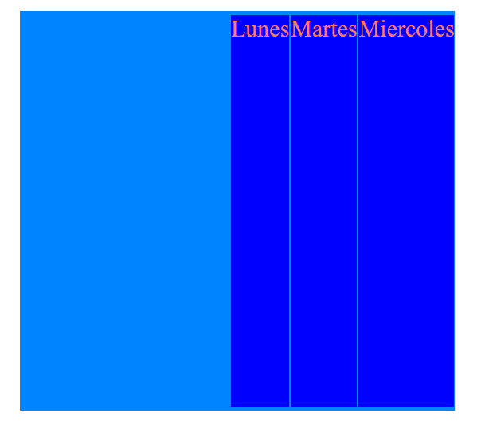
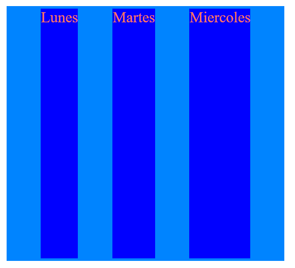
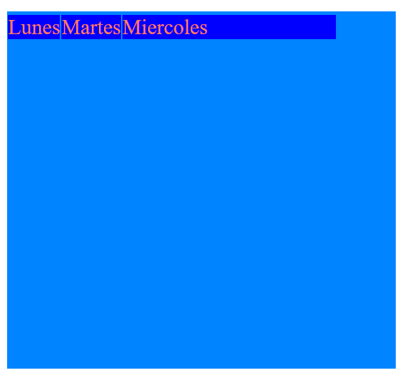
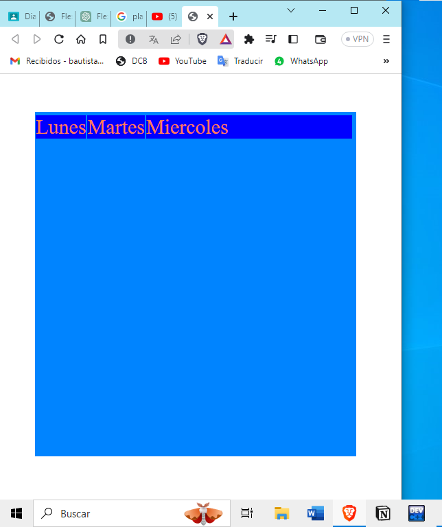

# FLEXBOX
Flexbox es una técnica de diseño en CSS (Cascading Style Sheets) que permite crear diseños flexibles y responsivos para organizar elementos en una página web. Con Flexbox, puedes controlar la distribución, el alineamiento y el tamaño de los elementos en un contenedor flexible, lo que facilita la creación de diseños que se adaptan a diferentes tamaños de pantalla y dispositivos.

Para entender Flexbox, es útil conocer algunos términos clave:

### Flex Container
Es el elemento padre que contiene los elementos hijos que deseas organizar con Flexbox. Para convertir un elemento en un contenedor flexible, simplemente aplicamos la propiedad display: flex; a dicho elemento en CSS.
```css
.padre{
    display: flex;
}
```

### Flex Items 
Son los elementos hijos contenidos dentro del Flex Container. Los Flex Items son los elementos que se organizarán y alinearán de acuerdo con las propiedades de Flexbox.

A continuación, describiré algunas de las propiedades principales de Flexbox:

## justify-content
La propiedad justify-content se utiliza para alinear y distribuir los elementos Flex en la dirección principal del contenedor flexible.
### flex-start
Es el valor por defecto, los elementos se alinean al principio del contenedor, es decir, izquierda arriba.

### flex-end
Los elementos se alinean al final del contenedor (derecha para una dirección de fila y abajo para una dirección de columna).

### center
Los elementos se alinean al centros del contenedor a lo largo de la direccion principal.

### space-betwenn
Distribuye los elementos con espacios iguales entre ellos, pero sin espacios antes del primer elemento y después del ultimo elemento.

### space-around
 Distribuye los elementos con espacios iguales alrededor de ellos, incluyendo espacios antes del primer elemento y después del último elemento.
 
### space-evenly
Distribuye los elementos con espacios iguales alrededor de ellos, incluyendo espacios antes del primer elemento y después del último elemento.

```css
.padre{
    display: flex;

    justify-content:flex-start; /* por defecto */
    /* justify-content: flex-end; se alinea a la izquierda */
    /* justify-content: center; se alinea al centro */
    /* justify-content: space-between;  espacio entre elemnetos */
    /* justify-content: space-around; espacio al inicio y al final de los elementos */
    /*justify-content: space-evenly; es espacio es igual*/
}
```
## aling-items
La propiedad align-items se utiliza para alinear los elementos Flex en la dirección secundaria del contenedor flexible (es decir, perpendicular a la dirección principal).
### flex-start
Los elementos se alinean al principio del contenedor en la dirección secundaria (arriba para una dirección de fila y izquierda para una dirección de columna).

### flex-end
Los elementos se alinean al final del contenedor en la dirección secundaria (abajo para una dirección de fila y derecha para una dirección de columna).

### center
Los elementos se alinean en el centro del contenedor en la dirección secundaria.

### stretch
Por defecto. Los elementos se estiran para ocupar toda la altura del contenedor en la dirección secundaria (solo si tienen un tamaño menor al contenedor).
 
```css
.padre{
    /* align-items: stretch; por defecto */
    /* align-items: center; centra los elementos con respecto al eje principal */
    /* align-items: flex-end; posiciona hasta abajo */
    align-items: flex-start; /* posiciona arriba */
}
```
## flex-direction
La propiedad flex-direction establece la dirección principal en la que los elementos Flex se distribuirán dentro del contenedor flexible.
### row
 (por defecto): Los elementos se distribuyen en una fila de izquierda a derecha.
 
### row-reverse
Los elementos se distribuyen en una fila de derecha a izquierda.

### column
Los elementos se distribuyen en una columna de arriba hacia abajo.

```css
.padre{
    flex-direction: row; /* por defecto */
    /* flex-direction: row-reverse; */
    /* flex-direction: column; */
}
```
## flex-wrap
La propiedad flex-wrap controla si los elementos Flex deben envolverse o no en el contenedor flexible cuando no tienen suficiente espacio para ajustarse en una sola línea.
### nowrap
(por defecto): Los elementos se mantienen en una sola línea y pueden superponerse si no hay suficiente espacio.

### wrap
 Los elementos se envuelven en múltiples líneas si no caben en una sola línea.
 
```css
.padre{
    /* flex-wrap: nowrap; valor por defecto */
    flex-wrap: wrap; /*  agrupa todo dentro de su padre */
}
```
## flex-flow
 La propiedad flex-flow es una propiedad abreviada que combina las propiedades flex-direction y flex-wrap en una sola declaración. Se utiliza para establecer la dirección principal y el comportamiento de envoltura de los elementos Flex en el contenedor flexible.

```css
.padre{
    flex-flow: row wrap; /*en esta linea sustituye la de direction y wrap*/ 
}
```
## aling-content
La propiedad align-content se utiliza para alinear y distribuir las filas de elementos en el contenedor flexible cuando hay espacio adicional en la dirección secundaria (perpendicular a la dirección principal). Es relevante solo si hay varias filas de elementos en el contenedor.
### flex-start
Las filas se alinean al principio del contenedor en la dirección secundaria.

### flex-end
 Las filas se alinean al final del contenedor en la dirección secundaria.

### center
Las filas se alinean en el centro del contenedor en la dirección secundaria.

```css
.padre{
    /* align-content: flex-start; alinea arriba */
    align-content: center; /* alinea al centro */
}
```
## align-self
 La propiedad align-self se utiliza para controlar el alineamiento de un elemento Flex individual dentro de su contenedor flexible. Permite anular la alineación especificada por la propiedad align-items del contenedor para ese elemento en particular.
### flex-start
El elemento se alinea al principio del contenedor en la dirección secundaria.

### flex-end
 El elemento se alinea al final del contenedor en la dirección secundaria.
 
### center
 El elemento se alinea en el centro del contenedor en la dirección secundaria.
 
```css
.hijo{
     /* align-self: flex-end; */
}
```
## flex-grow
La propiedad flex-grow determina cómo los elementos Flex deben crecer en relación con los demás elementos cuando hay espacio adicional en el contenedor flexible. Es una propiedad que controla la distribución del espacio sobrante después de que los elementos han ocupado su tamaño inicial (flex-basis) y se ha aplicado el espacio entre ellos (justify-content o align-items dependiendo de la dirección).

```css
.martes{
    flex-grow:1;
}
```
## flex-basis
La propiedad flex-basis establece el tamaño inicial de un elemento Flex antes de que se distribuya el espacio adicional o se apliquen las proporciones de crecimiento o reducción.

```css
.hijo{
    /* flex-basis: 300px; Establecemos el ancho inicial */
}
```

## flex-shrink
La propiedad flex-shrink define cómo los elementos Flex deben reducirse en tamaño cuando el espacio disponible en el contenedor es insuficiente para mostrar todos los elementos a su tamaño original. El valor de 0 no reducira ni aumentará.

```css
.hijo{
    /* flex-shrink: 1; le decimos que si puede encojerce qu elo haga */
}
```
## flex
La propiedad flex es una propiedad abreviada que combina las propiedades flex-grow, flex-shrink y flex-basis en una sola declaración. Se utiliza para controlar la flexibilidad y el tamaño de los elementos Flex dentro del contenedor flexible.

```css
.hijo{
    flex: 0 1 300px; /*sustituye a los otros 3 de flex*/
}
```

## order
 La propiedad order se utiliza para cambiar el orden de los elementos Flex dentro del contenedor flexible. Permite reorganizar visualmente los elementos sin cambiar la estructura del DOM (Documento de Objeto del Modelo) en HTML.
 
```css
.hijo{
    /* order: -2; */
}
```
