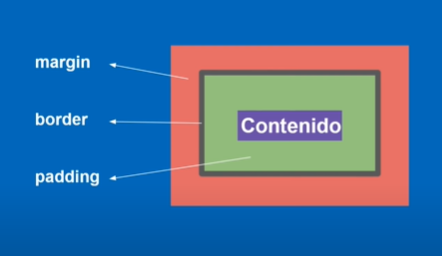

# MODELADO DE CAJAS

## Espacios en las cajas
Existen tres, el padding que es el alrededor del contenido, el border que es el borde que veremos en la pagina y el margin que es un espacio de separacion.


### Declaraciones y concatenaciones
En lugar de escribir en tu codigo de css los valores para cada lado de un atributo, por ejemplo
```css
.contenido{
    margin-top: 5px;
    margin-left: 6px;
    margin-bottom: 5px;
    margin-right: 6px;
}
```
Es mejor concatenarlo en uno, esto se puede aplicar a los tres espacios de cajas que vimos anteriormente.
```css
.contenido{
    margin: 5px 6px 5px 6px;
}
```
Si solo ponemos un valor se aplicara a todos los lados. Si ponemos dos se aplicara el primero para arriba y abajo y el segundo para la derecha e izquierda. Si declaramos tres valores el primero sera de la parte superior, el segundo de los lados, y el tercero de la parte de abajo. Con los 4 se aplica con el sentido de la manecillas del reloj.
```css
.conenido{
    margin: 0;
    margin: 2px;
    margin: 2px 6px;
    margin: 2px 6px 8px;
    margin: 3px 6px 9px 12px;
}
```

### Elementos de bloque y de linea
Los elementos de linea son los que no contienen ningun valore de cajas establecidos, mientas que los de bloque ya contienen elementos predeterminados.

## Comandos para los elementos
```css
.contenido{
    background-color: blue;
    padding: 5px 10px 12px 20px;
    border: 1px solid green;
    border-radius: 4px;
    margin: 15px;
    width: 50px;
    height: 50px;
    display: inline-block;
}
```
### Recordando algunos
* background-color se utiliza para cambiar el color de fondo.
* border-radius se usa para poner las esquinas redondeadas.
* width es para poner un ancho a la caja
* height: para el alto

### padding
Como ya lo vimos es el espacio dentro de la caja.
### border
Es el borde de la caja y este tiene tres caracteristicas, el primero es un tamaño, el segundo el tipo de borde que aplicara y el tercero el color.
### margin
Recordemos que es el margen que esta afuera de la caja, en los elementos de bloque se pegaran entre margenes si esta uno arriba de otro, para solucionarlo utilizamos el siguiente comando.
### display: inline-block
Con este las cajas estaran una al lado de la otra y no debajo, y se solucionara el problema de que se convinen los margenes.
<br><br><br>

## Estilos con enlaces
Para estos estilos en el html pondremos el atributo "a" la direccion y dentro de la etiqueta copiaremos el codigo que nos dan en la siguiente pagina de tu logo:
https://fontawesome.com/
```html
<div class="social">
    <a target="_blank" href="https://github.com/Cesbaut"><i class="fa-brands fa-github fa-beat" style="color: #000000;"></i></a>
    <a target="_blank" href="https://www.facebook.com/profile.php?id=100044077774092"><i class="fa-brands fa-facebook fa-beat" style="color: #0b84ee;"></i></a>
    <a target="_blank" href="https://www.instagram.com/cesbaut_/"><i class="fa-brands fa-instagram fa-beat" style="color: #e042ff;"></i></a>
    <a target="_blank" href="https://www.tiktok.com/@cesar_bautista_89"><i class="fa-brands fa-tiktok fa-beat" style="color: #000000;"></i></a>
</div>
```
Lo ponemos dentro de un div para despues modificar sus estilos, por ejemplo con la clase social:
```css
.social{
    padding: 9% 50%;
    font-size: 80px;
    margin: 30px 0;
    display: flex;
    align-items: center;
    justify-content: center; 
}
.social a{
    padding: 20px;
}
```


 ### Extra
 Podemos poner un * para decir que se apliquen los elementos a toda la pagina.
 ```css
 *{
    margin: 0;
    padding:0;
 }
 ```