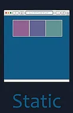
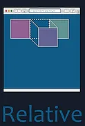
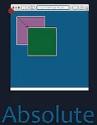
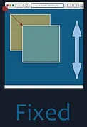
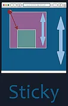
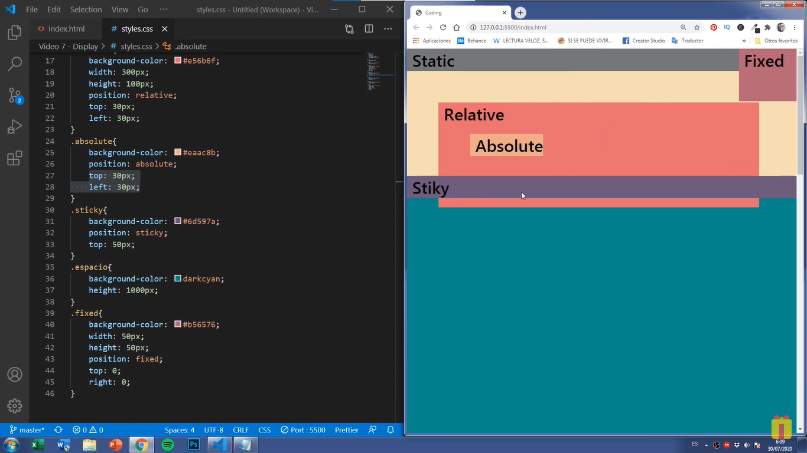

# POSITION CSS
La propiedad position en CSS permite controlar la posición de los elementos en una página web. Puedes aplicarla a cualquier elemento HTML y combinarla con otras propiedades para lograr el diseño deseado.
## position: static
Es el valor predeterminado para todos los elementos. Con position: static, los elementos se colocan en el flujo normal del documento, es decir, se apilan uno debajo del otro en el orden en el que aparecen en el HTML. Ignora las propiedades de desplazamiento (top, right, bottom, left) y la propiedad z-index. 
```css
.element {
  position: static;
}
```


## position: relative
Con position: relative, puedes desplazar un elemento de su posición original utilizando las propiedades de desplazamiento (top, right, bottom, left). El desplazamiento se realiza en relación con su posición normal en el flujo del documento. Aunque se mueva, seguirá ocupando espacio en el flujo del documento, lo que significa que otros elementos se colocarán como si el elemento desplazado todavía estuviera en su posición original.
```css
.element {
  position: relative;
  top: 20px;
  left: 10px;
}
```


## position: absolute
Con position: absolute, puedes posicionar un elemento de manera precisa en relación con su ancestro posicionado más cercano. Si no hay un ancestro posicionado, el elemento se posicionará en relación con el cuerpo del documento. Los elementos con position: absolute se eliminan del flujo normal del documento, lo que significa que no ocupan espacio y pueden superponerse a otros elementos. Puedes utilizar las propiedades de desplazamiento (top, right, bottom, left) para determinar la posición exacta del elemento.
```css
.element {
  position: absolute;
  top: 50px;
  left: 100px;
}
```


## position: fixed
Con position: fixed, un elemento se posiciona de manera precisa en relación con la ventana del navegador. A diferencia de absolute, el elemento permanecerá en su posición incluso si se desplaza la página. Es útil para elementos que deseas que siempre estén visibles, como encabezados o barras de navegación. Al igual que absolute, puedes usar las propiedades de desplazamiento (top, right, bottom, left) para ajustar su posición.
```css
.element {
  position: fixed;
  top: 20px;
  right: 30px;
}
```


## position: sticky
Con position: sticky, un elemento se comporta como relative hasta que se desplaza fuera de la vista, momento en el que se "adhiere" a una posición específica en la ventana del navegador. Por ejemplo, si tienes una tabla larga y deseas que el encabezado de la tabla permanezca visible mientras se desplaza, puedes aplicar position: sticky al encabezado. Requiere el uso de la propiedad top, right, bottom, o left para indicar la posición de "pegado" una vez que se desplaza.
```css
.element {
  position: sticky;
  top: 0;
}
```


<br><br>

