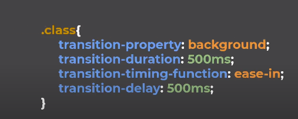

# Trancisiones en CSS
 Las transiciones son una forma de animar cambios en las propiedades de un elemento HTML. Permiten crear efectos suaves y visuales, como transiciones de color, tamaño, posición, opacidad, entre otros. las transiciones son una forma de animar cambios en las propiedades de un elemento HTML. Permiten crear efectos suaves y visuales, como transiciones de color, tamaño, posición, opacidad, entre otros.
 ## transition-property
 Esta propiedad define las propiedades que deseas animar. Puedes especificar una o varias propiedades separadas por comas. Aquí tienes un ejemplo con múltiples propiedades:
 ```css
 .elemento {
  transition-property: width, height, opacity, background-color;
  /* O también puedes usar 'all' para animar todas las propiedades. (sin embargo, no es recomendable)*/
  /* transition-property: all; */
}
 ```
 ## transition-duration
Esta propiedad establece la duración de la transición, es decir, el tiempo que tomará completar la animación. Puedes utilizar valores en segundos (s) o milisegundos (ms) (usar preferentemente). Recordemos que un segundo son 1000ms.
```css
.elemento {
  transition-duration: 1000ms; /* Un segundo */
}
``` 
## transition-timing-function
Esta propiedad controla cómo se produce la transición a lo largo de su duración. Hay diferentes funciones predefinidas que afectan la velocidad de la animación. Algunas de las funciones más comunes son:
* linear: La animación avanza a una velocidad constante durante toda la duración.
* ease: Es el valor predeterminado. La animación comienza lenta, se acelera en el medio y luego desacelera hacia el final.
* ease-in: La animación comienza lentamente y luego se acelera hacia el final.
ease-out: La animación comienza rápidamente y luego se desacelera hacia el final.
* ease-in-out: La animación comienza lentamente, acelera en el medio y luego se desacelera nuevamente.
* cubic-bezier(): para definir tu propia función de tiempo personalizada. Esta función requiere cuatro valores que controlan la curva de aceleración. Puedes ajustar estos valores para obtener efectos de transición más específicos.
```css
.elemento {
  transition-timing-function: cubic-bezier(0.25, 0.1, 0.25, 1);
}
```
Puedes utilizar la siguiente pagina web para encontrar mas ajustes:

https://cubic-bezier.com/#.17,.67,.83,.67

## transition-delay
Con esta propiedad, puedes establecer un retraso antes de que comience la transición. Esto puede ser útil si deseas que la animación se inicie después de un tiempo específico. Por ejemplo:
```css
.elemento {
  transition-delay: 0.5s; /* Inicia la transición después de medio segundo */
}
```

## transition (shorthand)
En lugar de definir cada propiedad por separado, también puedes utilizar el shorthand transition, que combina todas las propiedades en una sola línea. El orden es: transition-property, transition-duration, transition-timing-function y transition-delay.
```css
.elemento {
  transition: width 1000ms ease-in-out 500ms;
}
```
<br>
<br>




